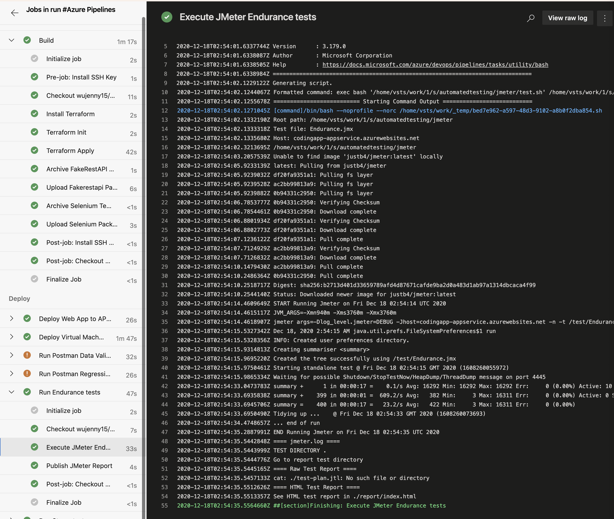

# Project3: Ensuring Quality Releases

# Terraform

Utilize Terraform to apply Infrastructure as Code (IaC) concepts to create different environment tiers that enable effective testing of code as it reaches the different phases of the release management process.

## Log output of Terraform

### Install Terraform

### Init Terraform

### Apply Terraform

# Automated Testing

## Jmeter

Design and run a load test suite post-deployment using JMeter to evaluate both a web application and web service’s performance (how well application performs under stress) in order to provide resource requirements, benchmarking metrics, and meet SLA (service level agreement) objectives.

## Selenium

Design and run functional test suites post-application-deployment using Selenium to evaluate the quality of a web application in order to identify, reduce, and prevent defects before a production release.

## Postman

Design and run API-integration tests post-application-deployment using Postman to evaluate the quality of a web service in order to reduce defects before a production release.

### Test Run Summary

Check reports under Test Plans → Runs.

### Test Results Page

### Publish Test Results

# Monitoring & Observability

## Azure Alerts

Configure Azure Monitor to identify and mitigate operational issues by using thoughtfully constructed alerts from a mixture of virtual machines and application services.

## Azure Log Analytics

Configure Azure Log Analytics to consume and aggregate custom application events in order to determine and address root causes of operational issues.

# Azure Pipeline Execution

